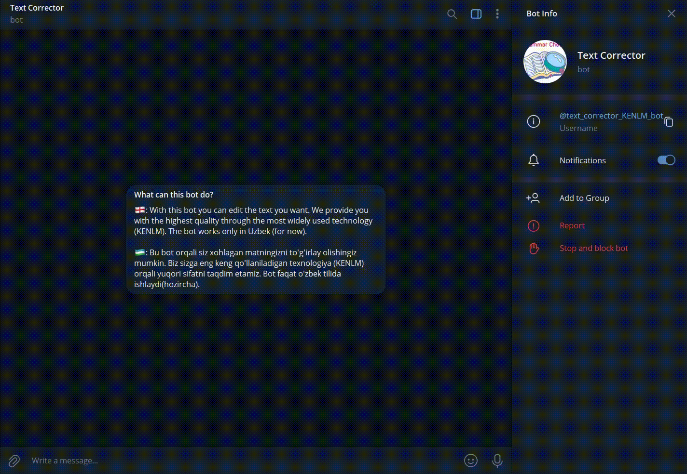

English | [O'zbekcha](README.uz.md)

# Text Correction

<!--https://github.com/shoxa0707/TextCorrectorWithKenlm.git/-->

Uzbek Text Error Correction Tool.

**Text Correction** Use the Levenshtein to calculate distance of two strings:
<br>
<a></a>

The Levenshtein distance (a.k.a edit distance) is a measure of similarity between two strings. It is defined as the minimum number of changes required to convert string a into string b (this is done by inserting, deleting or replacing a character in string a). The smaller the Levenshtein distance, the more similar the strings are. This is a very common problem in the application of Dynamic Programming.

Then use KENLM language model to correct sentence from Levenshtein candidates.<br>
This is done by choosing the word with the highest probability:<br>

<a></a>

**The main part is the [kenlm](https://github.com/kpu/kenlm) language model**

KenLM: Faster and Smaller Language Model Queries. It can reduce time and memory size significantly. It supports arpa files. Arpa files statistical language describe probabilities of the texts, they are trained on large corpora of text data. They can be stored in various text and binary formats, but the common format supported by language modeling toolkits is a text format called ARPA format. This format fits well for interoperability between packages. It is not as efficient as most efficient binary formats though, so for production, it is better to convert ARPA to binary.

# Installation

- install kenlm

```
pip install https://github.com/kpu/kenlm/archive/master.zip
```

- install others

```
pip install -r requirements.txt
```

# Deployments

## python console code

```
python run.py
```

result:

```
input: salim alaykim
output: salom alaykum

input: yaxshimisizlar ishlar yaxshima
output: yaxshimisilar ishlar yaxshimi
...
```

## Streamlit

```
streamlit run stream.py
```


## Telegram bot

```
python bot.py
```


