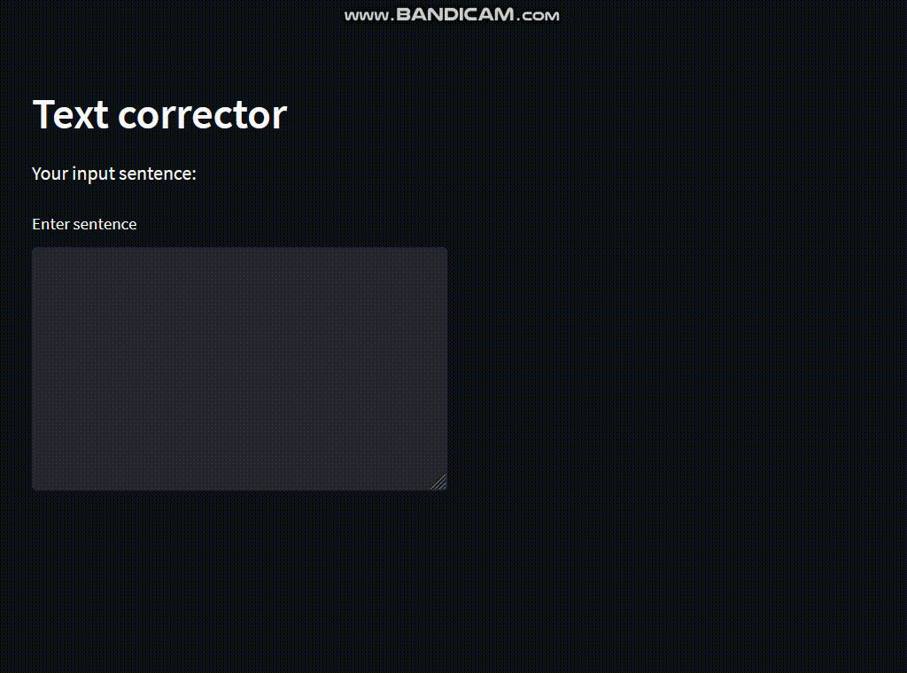

[English](README.md) | O'zbekcha

# O'zbek matn xatosini to'g'irlash

O'zbekcha matn xatosini tuzatish vositasi.

**O'zbek matn xatosini to'g'irlash** Ikki so'zning masofasini hisoblash uchun Levenshteindan foydalaniladi:
<br>
<a></a>

Levenshtein masofasi (a.k.a tahrirlash masofasi) ikki qator o'rtasidagi o'xshashlik o'lchovidir. U a satrni b satrga aylantirish uchun zarur bo'lgan o'zgarishlarning minimal soni sifatida aniqlanadi (bu a satrga belgi qo'yish, o'chirish yoki almashtirish orqali amalga oshiriladi). Levenshtein masofasi qanchalik kichik bo'lsa, iplar shunchalik o'xshash bo'ladi. Bu Dinamik dasturlashni qo'llashda juda keng tarqalgan muammo.

Keyin Levenshtein nomzodlarining jumlalarini tuzatish uchun KENLM til modelidan foydalaniladi.<br>
Bu ish eng yuqori ehtimoli bo'lgan so'zni tanlash orqali amalga oshiriladi:<br>

<a></a>

**Asosiy qism [kenlm](https://github.com/kpu/kenlm) til modeli hisoblanadi**

KenLM: Tezroq va kichikroq til modeli so'rovlari. Bu vaqt va xotira hajmini sezilarli darajada kamaytirishi mumkin. U arpa fayllarni qo'llab-quvvatlaydi. Arpa fayllar statistik til matnlarning ehtimolliklarini tavsiflaydi, ular matn ma'lumotlarining katta korpusida o'qitiladi. Ular turli xil matn va ikkilik formatlarda saqlanishi mumkin, ammo tilni modellashtirish asboblar to'plami tomonidan qo'llab-quvvatlanadigan umumiy format ARPA formati deb ataladigan matn formatidir. Ushbu format paketlar o'rtasida o'zaro ishlash uchun juda mos keladi. Bu eng samarali ikkilik formatlar kabi samarali emas, shuning uchun ishlab chiqarish uchun ARPA ni ikkilik formatga aylantirish yaxshiroqdir.

# O'rnatish

- kenlm modulini o'rnatish

```
pip install https://github.com/kpu/kenlm/archive/master.zip
```

- boshqa kerakli modullarni o'rnatish

```
pip install -r requirements.txt
```

# Foydalanish

## python konsol kodi

```
python run.py
```

natija:

```
kirish: salim alaykim
chiqish: salom alaykum

kirish: yaxshimisizlar ishlar yaxshima
chiqish: yaxshimisilar ishlar yaxshimi
...
```

## Streamlit

```
streamlit run stream.py
```



## Telegram bot

```
python bot.py
```


